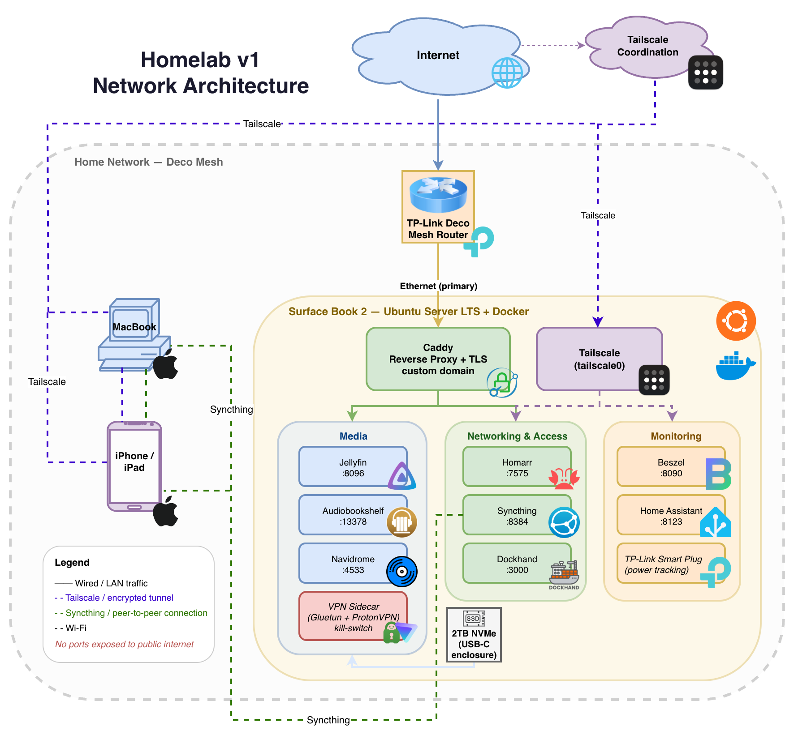

# 🖥️ Homelab v1

A home server built on a **Surface Book 2** with a shattered display, running 15+ self-hosted services since June 2025. This repo documents how it's set up, why I made certain decisions, and some of the problems I ran into along the way.

---

## 🧰 Skills & Technologies

| Category        | Tools & Concepts                                                                                                          |
| --------------- | ------------------------------------------------------------------------------------------------------------------------- |
| **OS & Kernel** | Ubuntu Server LTS, Linux Surface Kernel, systemd                                                                          |
| **Networking**  | Caddy (reverse proxy), Tailscale (mesh VPN), DNS routing, TLS/SSL                                                         |
| **Containers**  | Docker, Docker Compose, multi-container service stacks                                                                    |
| **Monitoring**  | Beszel (system metrics), TP-Link smart plugs (power tracking), SMTP email notifications (container health, system status) |
| **Storage**     | NVMe over USB-C, EXT4, UUID-based fstab mount persistence                                                                 |
| **Security**    | VPN sidecar (network isolation), kill-switch enforcement, no public port exposure                                         |
| **Automation**  | Dockhand (container lifecycle), Syncthing (cross-platform file sync)                                                      |

---

## 🏗️ Architecture Overview

The server runs headless on a Surface Book 2. Obviously not typical server hardware, which created real constraints around driver support and power management.

  <picture>
    <source media="(prefers-color-scheme: dark)" srcset="assets/homelab-v1-network-diagram-dark.png">
    <source media="(prefers-color-scheme: light)" srcset="assets/homelab-v1-network-diagram-light.png">
    
  </picture>

**Hardware**

- **Host:** Microsoft Surface Book 2 13.5" (headless)
- **CPU:** Intel Core i7-8650U (4-core, 8th Gen)
- **GPU:** NVIDIA GTX 1050 (hardware transcoding via NVENC/NVDEC)
- **RAM:** 16GB
- **Primary Storage:** 512GB internal SSD
- **Expanded Storage:** 2TB WD Black SN770 NVMe via Sabrent USB 3.2 enclosure

**Power draw:** ~12.6 kWh/month running 24/7, after offloading transcoding to the GPU and tuning idle power states.

---

## 🛠️ Notable Setup Decisions

**Linux Surface Kernel** — Standard Ubuntu Server doesn't have drivers for Surface hardware out of the box. Installing the community Surface Kernel got the NVIDIA GPU and power management working correctly.

**GPU-Accelerated Transcoding** — Set up NVENC/NVDEC passthrough into Docker so Jellyfin uses the GTX 1050 for transcoding instead of the CPU. Idle draw dropped from ~23W to under 17W, and thermals stopped being a problem under load.

**Modular Docker Compose Stacks** — Each logical group of services has its own Compose file rather than one giant stack. Makes it easier to restart, update, or debug a single service group without touching everything else.

**Remote Access via Tailscale** — All services are reachable over Tailscale from anywhere, with no ports exposed to the internet. Caddy handles TLS and gives everything a clean HTTPS address on the local network and over the VPN.

**VPN Sidecar for Network Isolation** — Certain containers route through a VPN sidecar with a kill-switch rule that drops all outbound traffic if the tunnel goes down. Prevents unencrypted egress on failure rather than failing open.

---
## 🔧 Issues & Write-Ups

Problems encountered during 8+ months of operation, documented with root cause and resolution. New entries added regularly.

| Date | Issue | Post          |
| ---- | ----- | ------------- |
| 2025-06 | ISP CGNAT blocking port forwarding, resolved with Tailscale mesh VPN | [CGNAT & Tailscale](https://medium.com/@aidanleddy/the-blessing-of-a-closed-port-how-cgnat-forced-me-to-build-a-better-homelab-19a42a07b5a2?source=friends_link&sk=19516024ace502fceb8ed64ebd9242b1) |
| —    | —     | _Coming soon_ |

---

## 🐳 Services Running

### Media

- **Jellyfin** — Media server with NVENC/NVDEC hardware transcoding
- **Audiobookshelf** — Audiobook and podcast server with cross-device progress sync
- **Navidrome** — Music streaming with Subsonic-compatible API

### Networking & Access

- **Caddy** — Reverse proxy with automatic TLS
- **Tailscale** — Mesh VPN for remote access without port forwarding
- **Homarr** — Service dashboard

### Monitoring & Maintenance

- **Beszel** — System metrics and uptime monitoring
- **Dockhand** — Automated container updates with health-check alerting
- **Syncthing** — Continuous file sync across server, desktop, and mobile (iOS/iPadOS)

---

## 📌 Background

Started this in June 2025 to get hands-on time with Linux administration, networking, and containers beyond what coursework and certs cover. It's grown beyond 15 services over 8 months, and most of the real learning came from breaking things and figuring out why. I've been documenting those incidents as I go, and write-ups will be linked in the Issues table above as they get published.

---
