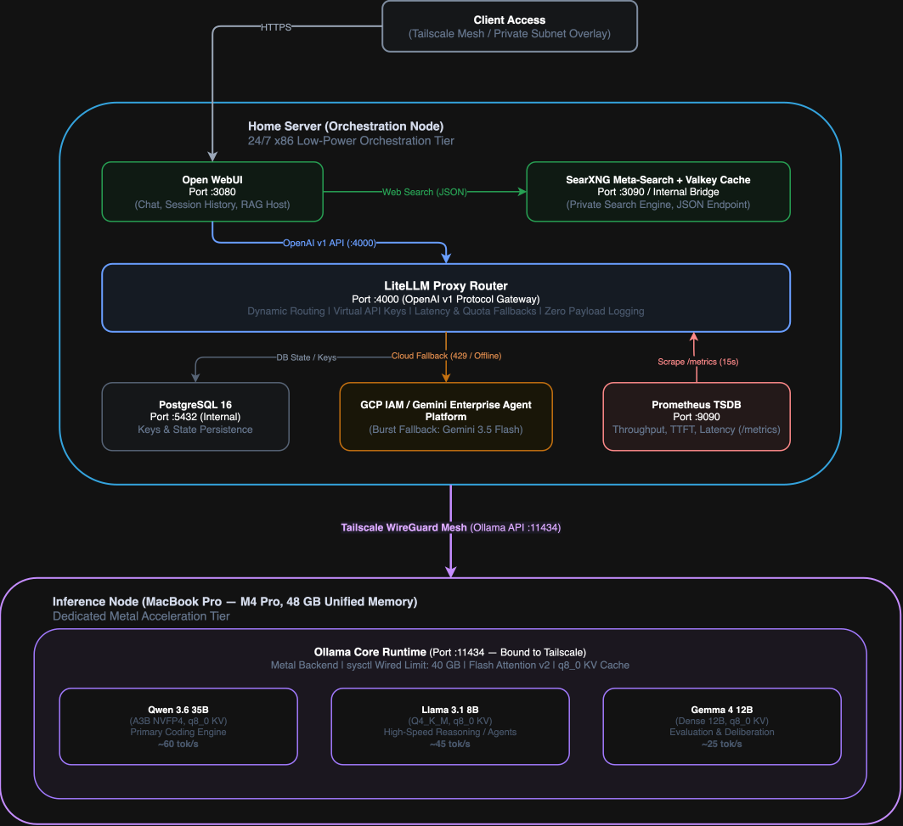
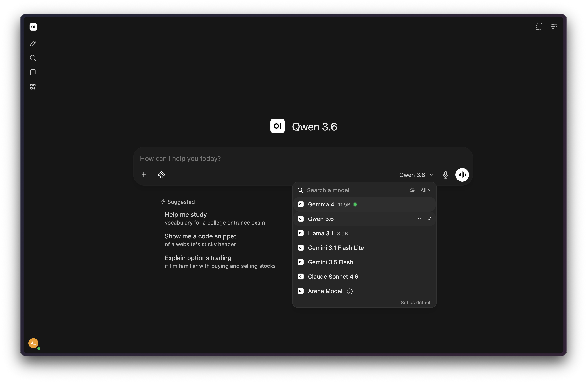
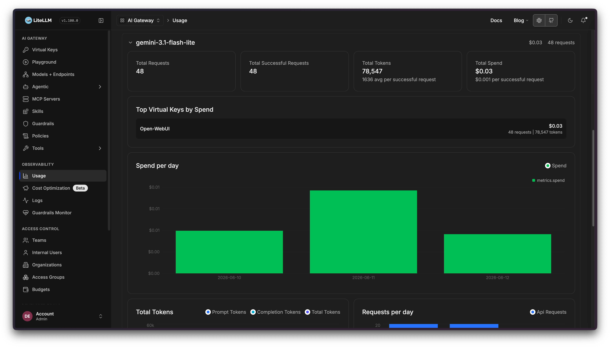
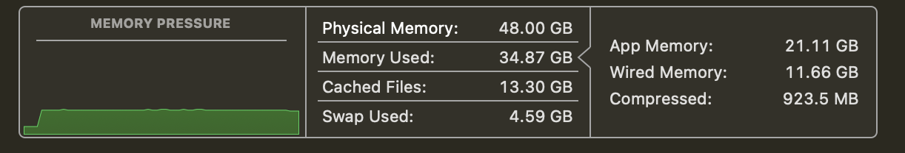
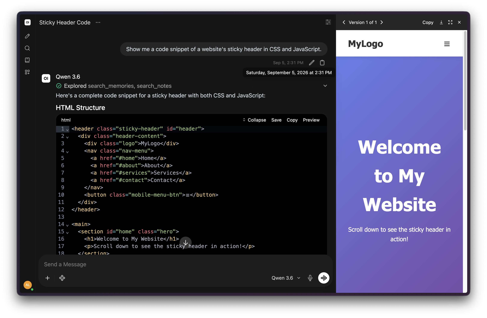

# Local AI Setup: Home Server + Apple Silicon over WireGuard

A self-hosted AI platform running across a home server and an Apple Silicon inference node, connected over an encrypted Tailscale/WireGuard connection.

This directory holds the infrastructure config, telemetry pipelines, and model routing setup for a local alternative to hosted AI platforms. Built to keep data on hardware I control and provide visibility into what the system is doing.

## System Architecture

<p align="center">
  <picture>
    <source media="(prefers-color-scheme: dark)" srcset="../assets/ai-stack-architecture-dark.svg">
    <source media="(prefers-color-scheme: light)" srcset="../assets/ai-stack-architecture-light.svg">
    
  </picture>
</p>

## Design Decisions

### 1. Splitting orchestration from inference

Running LLMs on typical home server hardware (CPU or a modest consumer GPU) means slow token generation or a lot of wasted idle power. So the two tiers are split:

- **Home server (24/7 x86):** web interface, database state, session persistence, search, and telemetry which is all low-power, always-on work.
- **Inference node (Apple Silicon):** the 48 GB of unified memory gives 150–300 GB/s of memory bandwidth to the GPU cores via Metal, which is enough to run 30B+ parameter models entirely in fast memory without needing a discrete GPU.

At roughly 1 GB of memory per 1B parameters at 4-bit quantization, plus 1–2 GB of headroom per active context window, a 35B model needs care to stay inside the node's memory budget. See **Host Tuning** below for how that's handled.

### 2. Unified routing with LiteLLM



Instead of hardcoding which client talks to which backend, everything goes through a LiteLLM proxy that speaks the OpenAI v1 API. If the local node is offline, asleep, or maxed out, requests fail over to cloud models hosted on Google Cloud's Gemini Enterprise Agent Platform (such as Gemini 3.5 Flash). Rate-limit responses (HTTP 429) from the cloud fallback are handled the same way, routed to the next model in the chain.

### 3. Monitoring



LiteLLM exposes runtime metrics at `/metrics`, and Prometheus scrapes them every 15 seconds. That gives me time-to-first-token, tokens/sec by model, and error rates instead of treating the whole thing as a black box.

### 4. Keeping search local

Open WebUI's RAG pipeline routes through a self-hosted SearXNG instance (with Valkey caching) instead of commercial search APIs, preventing prompt-driven queries from being logged or tied to an advertising profile. SearXNG is configured to return strict JSON rather than HTML, which sidesteps some known parsing instability in Open WebUI's web-search integration (see [issue #25585](https://github.com/open-webui/open-webui/issues/25585)). This also avoids feeding raw page markup into the model's context, which is a mild prompt-injection risk.

### 5. No public exposure

Nothing is exposed to the public internet. The home server and the MacBook talk to each other only over the Tailscale WireGuard mesh.

## Host Tuning

### macOS unified memory ceiling

By default, macOS reserves roughly 75% of unified memory for the GPU (~36 GB on this 48 GB host), keeping the rest for the OS. A 35B model with a 32k-token context window pushes past that limit and macOS starts swapping to disk, which tanks generation speed without any obvious warning.

Raising the wired memory ceiling to 40 GB helps, and a launch daemon makes the setting survive reboots:

```bash
# Apply immediately
sudo sysctl iogpu.wired_limit_mb=40960
```

```xml
<!-- /Library/LaunchDaemons/com.local.iogpu-wired-limit.plist -->
<?xml version="1.0" encoding="UTF-8"?>
<!DOCTYPE plist PUBLIC "-//Apple//DTD PLIST 1.0//EN" "http://www.apple.com/DTDs/PropertyList-1.0.dtd">
<plist version="1.0">
<dict>
    <key>Label</key>
    <string>com.local.iogpu-wired-limit</string>
    <key>ProgramArguments</key>
    <array>
        <string>/usr/sbin/sysctl</string>
        <string>iogpu.wired_limit_mb=40960</string>
    </array>
    <key>RunAtLoad</key>
    <true/>
</dict>
</plist>
```

```bash
sudo launchctl bootstrap system /Library/LaunchDaemons/com.local.iogpu-wired-limit.plist
```

With that ceiling in place, operational context budgets are capped per model size to prevent swap: up to 32k tokens for the 35B model, 64k tokens for the 12B model, and 128k tokens for the 8B model.



## Stack Components

|Service|Image|Role|Port|
|---|---|---|---|
|Open WebUI|`ghcr.io/open-webui/open-webui:main`|Chat interface, history, auth, RAG orchestration|`:3080` (internal)|
|LiteLLM Proxy|`docker.litellm.ai/berriai/litellm:main-stable`|Model gateway, rate limiting, metrics export|`:4000` (internal)|
|LiteLLM DB|`postgres:16-alpine`|Keys, budgets, model metadata|`:5432` (private net)|
|Prometheus|`prom/prometheus:latest`|Metrics scrape + storage|`:9090` (internal)|
|SearXNG|`docker.io/searxng/searxng:latest`|Meta-search for RAG|`:3090` (internal)|
|SearXNG Valkey|`docker.io/valkey/valkey:9-alpine`|Search query cache|internal bridge|
|Ollama|Native macOS binary (Metal)|Inference backend for quantized weights|`:11434` (Tailscale only)|

## Deployment

### 1. Inference node (macOS / Apple Silicon)

Apply the wired memory ceiling (see **Host Tuning** above) before loading large models.

To ensure Ollama binds to your Tailscale mesh and persists runtime optimizations across reboots, define a user `LaunchAgent` to inject the environment variables at login:

```xml
<!-- ~/Library/LaunchAgents/com.local.ollama-env.plist -->
<?xml version="1.0" encoding="UTF-8"?>
<!DOCTYPE plist PUBLIC "-//Apple//DTD PLIST 1.0//EN" "http://www.apple.com/DTDs/PropertyList-1.0.dtd">
<plist version="1.0">
<dict>
    <key>Label</key>
    <string>com.local.ollama-env</string>
    <key>ProgramArguments</key>
    <array>
        <string>/bin/sh</string>
        <string>-c</string>
        <string>
            launchctl setenv OLLAMA_HOST "100.x.y.z:11434"
            launchctl setenv OLLAMA_FLASH_ATTENTION "1"
            launchctl setenv OLLAMA_KV_CACHE_TYPE "q8_0"
        </string>
    </array>
    <key>RunAtLoad</key>
    <true/>
</dict>
</plist>
```

Load the agent and restart Ollama:

```bash
# Load the persistent environment agent
launchctl bootstrap gui/$(id -u) ~/Library/LaunchAgents/com.local.ollama-env.plist

# Restart Ollama to pick up the injected variables
pkill Ollama && open -a Ollama

# Shell runtime flags (for standalone CLI sessions) in ~/.zshrc
export OLLAMA_HOST="100.x.y.z:11434"
export OLLAMA_FLASH_ATTENTION="1"       # optimized attention kernels
export OLLAMA_KV_CACHE_TYPE="q8_0"      # 8-bit quantized KV cache

source ~/.zshrc
ollama run qwen3.6:35b-a3b-coding-nvfp4
ollama run llama3.1:8b
ollama run gemma4:12b
```

*(Note: Replace `100.x.y.z:11434` with your node's specific Tailscale IP.)*

### 2. Secrets and environment

```bash
cp .env.example .env

openssl rand -hex 32   # WEBUI_SECRET_KEY
openssl rand -hex 16   # LITELLM_SALT_KEY
```

For cloud fallback via Google Cloud's Gemini Enterprise Agent Platform, drop a service account key at `config/gcp-creds.json`. Scope the service account as narrowly as your GCP project allows (e.g. Agent Platform User role).

### 3. Bring it up

```bash
docker compose up -d

# Check container health
docker compose ps

# Confirm Prometheus is scraping
curl -s http://localhost:9090/api/v1/targets | grep -q '"health":"up"' && echo "Prometheus target up"
```

## Logging and Data Handling

LiteLLM is configured with `turn_off_message_logging: true`, so prompt and completion text is redacted from container logs. Only token counts and metadata are retained (`always_include_stream_usage: true`), which is what powers the throughput metrics below without storing what was said.

## Measured Performance



> **Note (Benchmarked Q2 2026):** Metrics reflect point-in-time testing. To swap in newer weights, run `ollama pull <model>` on the inference node and update the route targets in `config/litellm.yaml`.

|**Model**|**Prompt tokens**|**Completion tokens**|**Generation speed**|**Prompt eval speed**|**Time to first token***|**Total time**|
|---|---|---|---|---|---|---|
|**Qwen 3.6 35B**|6,236|1,888|60.3 tok/s|47,653 tok/s|~0.17s|31.5s|
|**Llama 3.1 8B**|4,096|1,024|~52.0 tok/s|~1,850 tok/s|~2.2s|~22.0s|
|**Gemma 4 12B**|5,279|1,164|24.6 tok/s|200.3 tok/s|~28.0s|86.7s|

\*Load duration + prompt eval duration. Haven't drawn a conclusion on the major gaps in prompt-eval speed yet. See lesson 4 below.

## Tradeoffs and Lessons Learned

1. **`q8_0` KV cache quantization vs. float16:** Cut memory use per context window by ~45% with no observable degradation in code generation, providing the headroom needed to run a 35B model alongside system processes without paging.

2. **Context-length scaling on TTFT:** While Apple Silicon maintains steady decode speeds on MoE models (~60 tok/s), time-to-first-token spikes non-linearly beyond ~16k tokens during cold prompt evaluation. Workloads are split by operational profile: lightweight 8B models handle general conversational queries to minimize latency, while the 35B model is reserved for code synthesis and structured tasks where decode throughput outweighs initial prompt ingestion overhead.

3. **Tool-calling stability in RAG pipelines:** Complex nested JSON schemas degraded tool reliability on smaller open-weight models. Qwen leverages native function calling, whereas Llama models rely on isolated schema extraction steps to avoid context corruption during SearXNG synthesis.

4. **MoE parameter economics:** Qwen3.6 35B (3B active parameters per token) achieved 60.3 tok/s, outperforming the dense Gemma 4 12B (24.6 tok/s). Decode throughput tracked active parameters, not total disk footprint. The much larger gap in prompt-eval speed (47,653 vs 200.3 tok/s) is still unexplained; memory pressure is ruled out, and I need to run tests to determine whether it's model-reload overhead or an attention-kernel difference.

5. **macOS memory ceiling as a silent failure mode:** Without overriding `iogpu.wired_limit_mb`, large context windows did not trigger an explicit OOM crash; macOS quietly paged inactive unified memory to swap, destroying inference throughput. Raising the Metal wired limit to 40 GB prevents premature memory thrashing, stabilizing sustained generation speeds.

6. **Paged SSD KV caching.** Tools like oMLX persist KV cache blocks to disk so a returning prompt prefix skips recomputation. Potentially useful if I move toward multi-turn agentic workflows where the same context gets sent repeatedly, but haven't tested yet.